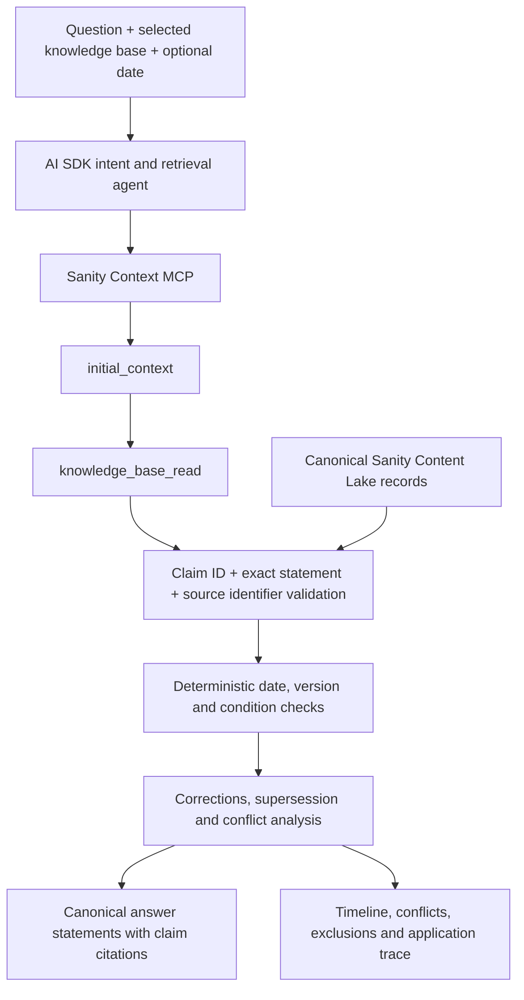

# TruthGraph

**Which answer applies?** A question-first evidence agent for Sanity Challenge Path One.

Ask a question about a selected knowledge base. TruthGraph retrieves claims, checks their applicability, follows explicit corrections, exposes disagreements, and cites the records behind its answer. It is no longer a Next.js upgrade checker: subjects, properties, versions, conditions, and relationships are content, not fixed controls.

This directory retains its original name so existing workspace paths still work. It is independent of Path Two.

## Watch the Demo

[Watch the narrated walkthrough](https://truthgraph-mauve.vercel.app/demo.html) — about **1 minute 42 seconds**, in 1080p with English neural narration and captions. The video, screenshots, and guided examples are public and need no account or access code.

[](https://truthgraph-mauve.vercel.app/demo.html)

[Open the live app](https://truthgraph-mauve.vercel.app/) · [Download MP4](https://truthgraph-mauve.vercel.app/demo/truthgraph-demo.mp4) · [Read transcript](https://truthgraph-mauve.vercel.app/demo/narration.txt) · [Download screenshots](https://truthgraph-mauve.vercel.app/demo/screenshots.zip)

The walkthrough shows a changed goalkeeper rule, the same question for an earlier match date, missing match-type context, the Evidence Lab, and an inspectable Sanity claim and trace. The guided results are labelled recorded Sanity Context investigations, replayed while content is unchanged. Custom live questions require the judge access code.


*For a match on 1 March 2025, the six-second rule applies; the newer keyword result was not yet in effect.*

## Run Locally

Use Node.js 24 LTS:

```sh
npm ci
npm run dev -- --port 3000
```

Open http://localhost:3000. Choose **Start the guided tour** to explore the example collections, or add your documents by choosing files, dropping them onto the upload area, or pasting text. Review an import and optionally enter a first question to **Save and investigate** immediately. Inspect source previews, citations, excluded claims, conflicts, and the agent trace; export the investigation as Markdown.

Use **Import knowledge base** to add your own documents. Local imports are saved in this browser and can be investigated immediately; no account or code change is needed. See [Add Your Own Content](#add-your-own-content) for the reviewed upload and live indexing flow.

The default `APP_MODE=demo` uses corpus-driven token matching, not a language model, vector database, or Sanity MCP. Sample collections show **Sample / local retrieval**; personal imports show **Private / local preview**. Local language understanding is deliberately limited. Never present these runs as live Sanity integration.

## Three Explicit Modes

| Mode | What happens | Requirements |
| --- | --- | --- |
| Private preview | Inspect original excerpts and ask locally; uploads and questions stay in the browser | Supported text/JSON; no account |
| AI on this upload | Model interprets the question and selects provided claim IDs; the app returns validated original statements | `APP_MODE=live`, server-side `OPENAI_API_KEY` or `GOOGLE_GENERATIVE_AI_API_KEY`, an app access code, and explicit per-collection consent |
| Sanity Context | Agent navigates the mapped Knowledge Base through MCP, then validates claims and applicability | Actual Sanity account, canonical records, built/mapped Knowledge Base, organization token, and model configuration |

Immediate AI does not wait for Sanity indexing and does not publish a shared corpus. Its result is explicitly labelled **Direct upload / AI**, never Sanity MCP. Input and output are bounded; it uses no model tools or arbitrary URL fetching. Unknown or duplicated claim IDs are rejected, answers retain source statements, and self-declared source authority cannot produce a high-confidence badge. A provider error is shown, not silently replaced by a local answer.

This is a credible live demonstration for supported documents, not a promise to answer every question about every format. Absent evidence returns an insufficient result; effective-date and conflict reasoning still need authored metadata. Direct-upload analysis is an additional convenience, not a substitute for the challenge's real Sanity demonstration. The hosted sports guided tour was exercised through the deployed app for the 2 October 2026 recording. A separate installation still needs its own credentials and live validation; this recording does not verify direct-upload AI.

## Evidence Lab

After an investigation, open **Evidence Lab** to compare the original claim states with a hypothetical version, date, or named condition. Controls come from the retrieved records, so a corpus can use a region, edition, membership tier, or other authored condition. The existing deterministic applicability and correction rules evaluate the scenario without another model or MCP call.

Uncheck sources to test how much the result depends on them. Every claim keeps its original statement, source, before/after state, and explanation. The original answer and conflicts are never replaced; excluding a disagreeing source is not a resolution. Unknown dates, partial version overlaps, missing conditions, and correction targets remain uncertain.

Use **Download comparison** for a portable JSON record containing the original investigation, scenario context, source exclusions, claim-state changes, and unresolved gaps. It is explicitly hypothetical, not a new live answer or a cryptographic proof. Only already retrieved evidence is considered, other evidence may exist, and comparisons do not establish freshness or completeness. A changed question disables the old comparison until a new investigation finishes. Exports may contain your document excerpts; review them before sharing.


## Guided Tour, Comparison, and Curation

- **Guided tour.** Three everyday collections ship with tours: the **Football rules desk** (IFAB Laws of the Game, featured first), the **Cricket rules desk** (MCC Laws and ICC playing conditions), and the **Chess rules desk** (FIDE Laws of Chess). Each tour shows a rule that was replaced, the same question on an older date, a question that depends on the match type or competition, and a recent change. The technical Node.js & Next.js lifecycle desk keeps its five questions, including two official sources that disagree. In live mode tour questions run without an access code under a shared rate limit. Each is reused as a recorded live run only while the question, every canonical record, and the set of claims in effect today are unchanged; the trace says when it was recorded.
- **Keyword search vs TruthGraph.** Every result shows the top keyword hit from the same knowledge base and the structural reason it would mislead (outdated, wrong scope, wrong date, missing context, hidden conflict), or says when it agrees.
- **Curate** (live mode, `KNOWLEDGE_ADMIN_CODE` + `SANITY_WRITE_TOKEN`): a conflict inbox to record which claim supersedes or corrects another, undo decisions, edit or delete claims with revision checks, and record an index review after rebuilding entries in Sanity. Decisions are stored on the Sanity claims.
- **Document budget.** The app counts published dataset documents against the 150-document Knowledge Base budget and refuses imports that would exceed it.
- **Sharing.** Copy a question link, or (with a write token) publish a signed snapshot of a live result to `/investigations/<id>` after explicit consent.
- **Test documents.** The import panel links source-backed files in `public/sample-documents/`: the football rules JSON, the lifecycle corpus JSON, a Python lifecycle JSON (PEP 373 and Python Developer's Guide), and a public-domain PEP 373 excerpt. `npm run export:kb` also writes cricket and chess bundles.

## Demonstration Cases

| Capability | Knowledge base and question | Expected behavior |
| --- | --- | --- |
| Rule replaced | Football: "What happens if a goalkeeper holds the ball too long?" | Corner kick after eight seconds (since 1 July 2025); the six-second rule is shown as no longer in effect |
| Match date | Football, same question as of 2025-03-01 | Indirect free kick after six seconds |
| Match type | Football: "How many substitutes can a team use?", then add "in an international friendly" | Asks which kind of match; then eight, or up to eleven by agreement |
| Level on one date | Cricket: "Was a bunny-hop boundary catch allowed in club cricket on 2026-03-01?" | Yes in club cricket, while international cricket had banned it since June 2025 |
| Edition by date | Chess: "Can I keep my switched-off phone in my pocket during a game?" now and as of 2012-05-01 | Forbidden today; allowed if switched off under the 2009 Laws |
| Time control | Chess: "What happens after an illegal move?", then add "in blitz" | Asks standard, rapid or blitz; then the blitz penalty |
| Correction | Lifecycle desk: "What is the end-of-life date for Node.js 16?" | September 11, 2023; the April 2024 plan is shown as corrected |
| Effective dates | "Does Node.js 20 still get security updates?" | End-of-Life since April 30, 2026; earlier phases excluded by date |
| Date in question | "Will Next.js 15 still receive security fixes on 2026-11-01?" | Outside the LTS policy from October 21, 2026 |
| Conditions | "Should I use proxy or middleware in Next.js 16?", then add "on the edge runtime" | Asks for the runtime; then answers middleware |
| Unresolved conflict | "Will Node.js 27 be promoted to LTS?" | Two official pages disagree; no invented winner until a curator records precedence |
| Version applicability | "What Node.js runtime does Next.js 16 require?" | 20.9.0; the Next.js 15 claim is excluded as out of scope |
| Missing evidence | "What is the warranty on a camera?" | Insufficient evidence |
| What-if comparison | Any result, open Evidence Lab | Change version/date/conditions without another API call |

**The reasoning lab is entirely synthetic.** Atlas, its manuals, policies, and corrections are invented test material. The UI labels it, its URLs are not presented as real sources, and it is excluded from the default Sanity seed and source export. Choose a real domain with actual dated corrections before presenting these capabilities as real-world challenge evidence.

## Architecture



The agent chooses relevant entries based on the question. It is not instructed to run a fixed list of checks. The endpoint and allowed Knowledge Base ID are server-controlled; the model cannot switch to another corpus. A failed or skipped outline is an error, not an insufficient-evidence result.

The final factual answer uses the canonical statements that were found in MCP-retrieved entries. The model interprets intent and selects evidence; it does not author unchecked factual prose. Every returned statement is validated against an applicable cited claim. This is not an entailment proof or a guarantee that the source itself is correct.

## Schema Strategy

| Sanity type | Purpose |
| --- | --- |
| `tgKnowledgeBase` | Title, purpose, real/synthetic classification, suggested questions, and its platform-generated `kb...` mapping |
| `tgSource` | Original HTTPS URL or uploaded-text SHA-256 identifier, optional filename/original text, publisher, authority, publication date when known, and review date |
| `tgClaim` | Subject, predicate, value, source-backed statement, search aliases, exclusivity, optional version scope, effective dates, conditions, and claim relationships |

Relationships are stored in one direction: `supersedes`, `corrects`, `supports`, or `related`. Correction and supersession change precedence only when the replacing claim applies. Supports/related links are inspectable retrieval context, not automatic truth scores. Opposite-direction copies are not maintained.

Conflict detection applies only to claims explicitly marked exclusive, for the same subject and predicate in the same applicable scope. Different values on additive claims are not automatically contradictory. Newer or primary sources are not automatically allowed to override a conflicting claim. Missing counterpart records, cycles, partial version overlaps, and absent required conditions block a definitive answer.

Publication, review, and effective dates are separate. An explicit dated question without recorded effective dates requests more evidence rather than assuming historical applicability. Effective-until dates are exclusive. Semantic version ranges are supported; edition numbers or other non-semver distinctions can be represented as named conditions.

## Add Your Own Content

### Upload and Review

1. Choose documents from the first screen, or select **Import knowledge base**. Choose UTF-8 `.txt`, `.md`, or `.markdown` files, one structured `.json` bundle, or **Paste text**. The title defaults to the filename; purpose and source owner are optional and use explicitly user-provided defaults rather than inferred authority.
2. Review the excerpts and sources. Text imports retain literal statements, original text, filenames, and a SHA-256 fingerprint of the decoded text. They start as unverified sources, with no invented effective dates, version scopes, or correction links.
3. Confirm that you reviewed the material and have permission to import it. **Save locally** makes the corpus immediately selectable in either app mode. Enter an optional first question to **Save and investigate** in private preview immediately. Neither that upload nor that question is sent to a server or model.
4. Reload to restore imports. In **Knowledge bases**, export a JSON backup or indexing Markdown, or remove a local import with confirmation. Built-in samples are not removed. In configured live mode, select **AI on this upload**, enter the app access code, and consent before the collection's claim content and question are sent to the provider.

For example, import a workshop handbook containing opening hours and membership fees, then ask about those facts. The engine is not restricted to the bundled framework documentation.

Raw text uploads are limited to 8 files and 256 KB total; a structured JSON file can be up to 1 MB because it contains both source text and claim metadata. Each import contains one corpus, at most 20 sources and 100 claims. Invalid, oversized, inconsistent, or duplicate local document sets are rejected without overwriting saved imports. Browser storage is origin-specific, unencrypted, and subject to browser quotas; export a backup before clearing it. Do not use it for secrets.

For authored applicability and conflict reasoning, use the downloadable [JSON template](public/knowledge-base-template.json) or a previously exported bundle. It follows the shared catalog schema in [src/lib/knowledge.ts](src/lib/knowledge.ts). The template is explicitly synthetic: replace its example sources/claims and classification before treating it as real evidence. Existing IDs are rekeyed, relationships retained, and any supplied MCP mapping discarded. Plain text is not automatically converted into trustworthy semantic contradiction or date rules. PDF/Office parsing, arbitrary web crawling, and automatic metadata extraction are not implemented.

### Save to Sanity

1. Configure live mode as below. To enable management, also set a private `KNOWLEDGE_ADMIN_CODE` of at least 24 characters, different from `LIVE_ACCESS_CODE`, and a server-only `SANITY_WRITE_TOKEN`. Restart the server. The judge's read code never grants write access.
2. Review the upload, select **Sanity shared collection** as its destination, and choose **Save to Sanity**, entering the management code. The app creates the corpus, sources, and claims in one non-overwriting transaction. Synthetic fixtures are not accepted as shared imports. This stores content, not an MCP index: the corpus is marked **Awaiting index and verified mapping**.
3. Open **Connect Sanity Knowledge Base** for that corpus. Copy its dataset query into a Knowledge Base source in Sanity Context, or upload the exported indexing Markdown. Build entries and inspect them. Preserve exact claim IDs, statements, source identifiers, applicability metadata, and relationships.
4. Add that Knowledge Base to the Context endpoint. Enter its actual `kb...` ID in the app and select **Verify and save mapping**. The server verifies the available MCP outline and applies a revision-guarded mapping update. Outline verification alone does not prove that every indexed claim is grounded.
5. Investigate a known question using the judge code. For an imported corpus without suggested questions, set `KNOWLEDGE_BASE_RECORD_ID` and `LIVE_TEST_QUESTION` before `npm run check:live -- --exercise`.

Use **Refresh knowledge bases** to load published Sanity changes without restarting the app. Original uploaded text is retained in source records; exported local files are available in the current session, and Sanity data can be maintained through Studio. Local removal never deletes cloud records. File sources in Sanity are snapshots: replace/reupload and rebuild when content changes. No undocumented Knowledge Base creation or build API is simulated.

Studio remains an alternative authoring workflow. Use consistent subject/predicate names, mark exclusivity only for genuine same-scope contradictions, and encode dates and relationships only when the sources establish them. The final real corpus and its authority metadata require human review.

Respect the challenge's beta budget and your Sanity plan. The app independently bounds catalog reads to 20 knowledge-base records, 150 sources, and 150 claims, and each investigation to 60 selected claims. These application bounds do not increase platform quotas. Exceeding an application bound fails validation rather than silently truncating evidence.

## Connect Sanity Context

`npm run setup:live` is an optional guided setup in your own terminal. Credentials stay private. Manual setup:

1. Create/select a Sanity project and dataset. Use only public material in a public dataset; use a private dataset and a read token otherwise. Knowledge-base titles, descriptions, and suggestions are public UI metadata; do not put secrets there.
2. Configure `.env.local` privately. Do not paste keys into chat or a submission.

```dotenv
APP_MODE=live
SANITY_STUDIO_PROJECT_ID=YOUR_PROJECT_ID
SANITY_STUDIO_DATASET=production
SANITY_WRITE_TOKEN=YOUR_PROJECT_EDITOR_TOKEN_IF_SEEDING_OR_MANAGING_IMPORTS
SANITY_READ_TOKEN=
SANITY_CONTEXT_MCP_URL=https://api.sanity.io/v1/context/organizations/YOUR_ORG_ID/mcp/YOUR_ENDPOINT
SANITY_ORGANIZATION_TOKEN=YOUR_ORGANIZATION_CONTEXT_VIEWER_TOKEN
# Model: OpenAI (default) or Gemini. Only the chosen provider's key is needed.
MODEL_PROVIDER=openai
OPENAI_API_KEY=YOUR_OPENAI_API_KEY
OPENAI_MODEL=gpt-4.1-mini
# MODEL_PROVIDER=google
# GOOGLE_GENERATIVE_AI_API_KEY=YOUR_GEMINI_API_KEY
# GOOGLE_MODEL=gemini-3.5-flash-lite  (Gemini 3+ only; 2.5 cannot combine tools with JSON output)
LIVE_ACCESS_CODE=CHOOSE_A_PRIVATE_APP_CODE_AT_LEAST_24_CHARACTERS
KNOWLEDGE_ADMIN_CODE=
APP_URL=http://localhost:3000
```

3. Optionally run `npm run seed -- --dry-run`, then `npm run seed` to add the real corpus (football, cricket, and chess: 3 knowledge bases, 34 sources, 91 claims; the Node.js lifecycle desk stays a local sample) without overwriting existing records. `--update-existing` refreshes previously seeded records with revision checks, keeps MCP mappings and curation relationships, and backs up the prior versions to `tmp/`.
4. Run `npx sanity login`, `npm run sanity:schema`, and `npm run sanity:dev` to inspect/publish the generic schema and content.
5. Enable Context / Knowledge Bases in the organization Labs settings. Create a Knowledge Base from the selected corpus. For the starter corpus, `npm run export:kb` creates `knowledge-base/truthgraph.md`. A validated custom catalog can be exported with `npm run export:kb -- --catalog=/path/to/catalog.json`.
6. Indexing instructions: preserve claim IDs, **statements verbatim**, original source URLs or uploaded-text identifiers, version/date scopes, conditions, and relationships. Retain alternative and historical claims. Context synthesizes entries in its own words and lists the source records it used; grounding intentionally fails unless a retrieved entry cites each selected claim ID, and the answer quotes the canonical statement and source URL from Content Lake.
7. Map the platform's `kb...` ID into the corresponding Studio record. Create a Context endpoint with Knowledge Base sources, not a dataset source. A mixed endpoint defaults to GROQ mode; this app explicitly requests Knowledge Base mode and the selected ID.
8. Use an **organization Context Viewer** token for MCP, not a project token. Restart the app and run `npm run doctor` and `npm run check:live`.
9. Run `npm run check:live -- --exercise` for one actual, billed investigation based on the selected corpus's first suggested question. For multiple corpora, set `KNOWLEDGE_BASE_RECORD_ID`; optionally set `LIVE_TEST_QUESTION`. The check requires a supported, cited live answer. Inspect other outcomes and the trace in the browser.

The application never writes through Context MCP. Optional imports and mappings use the Sanity Content Lake client behind separate management authorization. Human conflict decisions stay in Sanity's issues/instructions workflow. If a decision changes a canonical claim, update the source record and rebuild the Knowledge Base so the two remain consistent. Leave `KNOWLEDGE_ADMIN_CODE` unset and omit the project write token on a read-only deployment.

## Verify

```sh
npm test
npm run typecheck
npm run lint
APP_MODE=demo npm run build
npx playwright install chromium
PLAYWRIGHT_BASE_URL=http://localhost:3000 npm run test:e2e
PLAYWRIGHT_LIVE_UI=1 npm run test:e2e
```

Without `PLAYWRIGHT_BASE_URL`, sample browser tests start their own dev server on port 3101. Do not start two Next.js dev processes in this project. The separate `PLAYWRIGHT_LIVE_UI=1` run requires a current build and starts an isolated production server on port 3102, with model responses intercepted by the browser test. Do not set `PLAYWRIGHT_BASE_URL` to your sample server for that run. It tests consent, access-code controls, private preview, provider failure, and direct-upload provenance without paid calls. CI executes both modes.

Tests also cover question-dependent retrieval, generic subjects, dates, patch ranges, conflicts, corrections, missing peers, cycles, malformed model output, citations, file validation, first-question paste/imports, persistence, export/reimport, removal, management authorization, mobile reflow down to 320px, and automated accessibility. These are not a full accessibility certification. Mocked MCP/Sanity/provider tests are not live-service evidence.

## Submission and Limits

Use [SUBMISSION.md](SUBMISSION.md) and [IMPLEMENTATION_NOTES.md](IMPLEMENTATION_NOTES.md). Choose and verify the final real corpus before claiming the full reasoning demonstration. Include the actual Sanity project ID, repository URL, deployed app URL, and application-only judge access instructions. Publish a separate Path One DEV post with `sanitychallenge`. Deadline: October 4, 2026 at 11:59 PM PDT.

The runtime remains Next.js, but that is an implementation framework, not the agent's subject restriction. The core is reusable across imported or curated knowledge bases, not an unbounded internet fact checker. Local token matching is deliberately limited; live imports, indexing, and retrieval require actual account configuration and have not been cloud-verified without it. No automatic KB build or conflict-resolution write API is fabricated.

Deploy this folder independently on a Node.js 24 Next.js host. Production requires explicit `APP_MODE`. Set a model-provider budget and host rate limiting; the 20-investigation/minute counter and separate 10-import/minute, 10-mapping/minute, and 10-direct-upload-analysis/minute counters are per-process. Sanity investigation requests are bounded to 8 KB, seven model steps, one retry, and a 55-second deadline. Direct-upload analysis uses a 1 MB request bound, 30 seconds, 2500 output tokens, and no model retry. Import requests are bounded to 1 MB and 30 seconds; mapping verification to 25 seconds. Codes and consent are held in form state, never saved in browser storage. This shared-code challenge app is not a multi-tenant identity or distributed quota system. Unrestricted anonymous public uploads would require additional identity, abuse controls, privacy/retention decisions, and operational validation.

Official interfaces rechecked October 1, 2026: [Context MCP](https://www.sanity.io/docs/ai/sanity-context-mcp), [MCP tools](https://www.sanity.io/docs/ai/sanity-context-mcp-tools), [Knowledge Bases](https://www.sanity.io/docs/ai/sanity-context-knowledge-bases), and the [challenge](https://dev.to/challenges/sanity-2026-09-16). AI SDK majors remain aligned and dependencies locked. DM Sans, DM Serif Display, IBM Plex Mono, and the bitmap brand mark are self-hosted; icons are Lucide. Path Two remains independent and unchanged.
